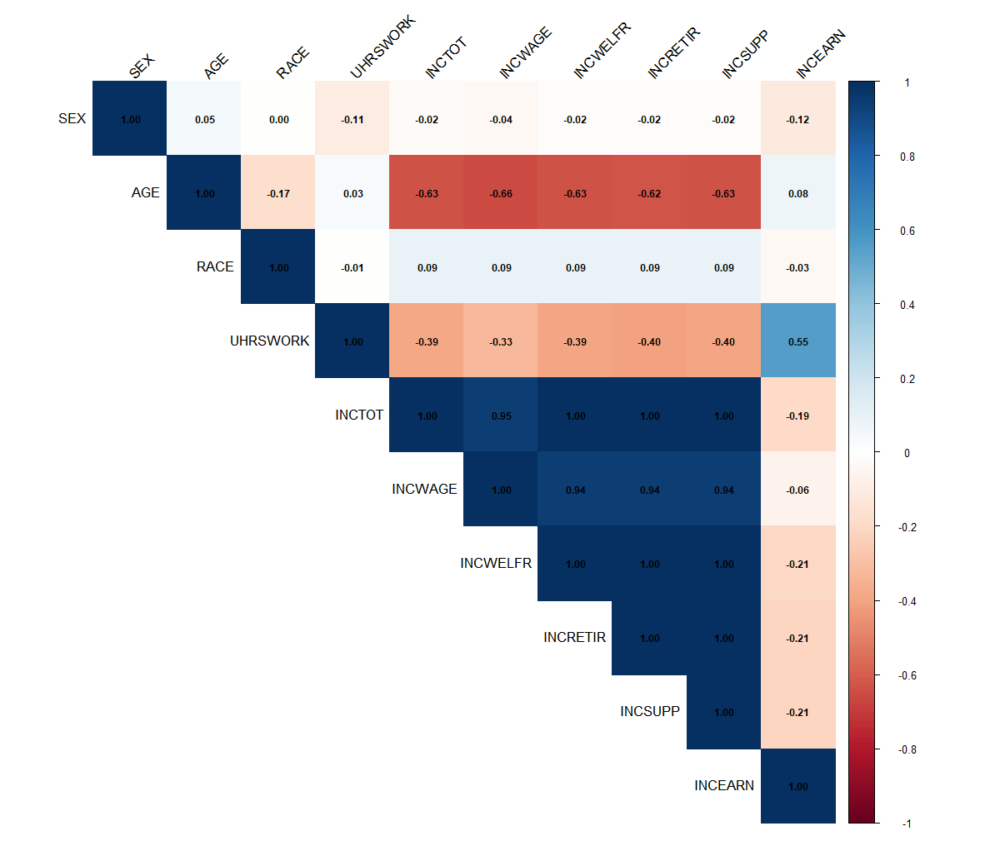
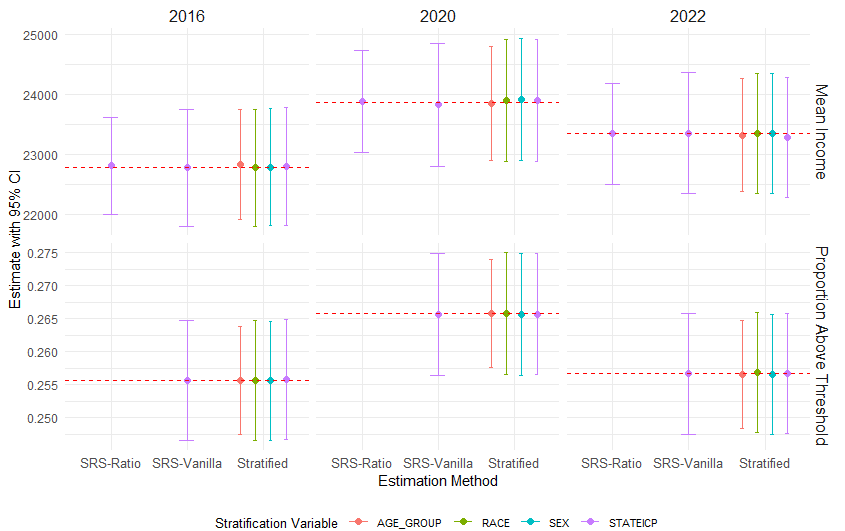
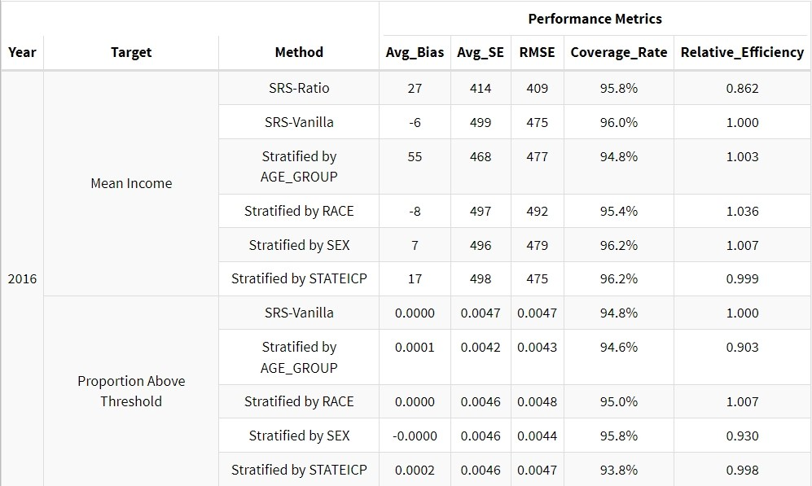
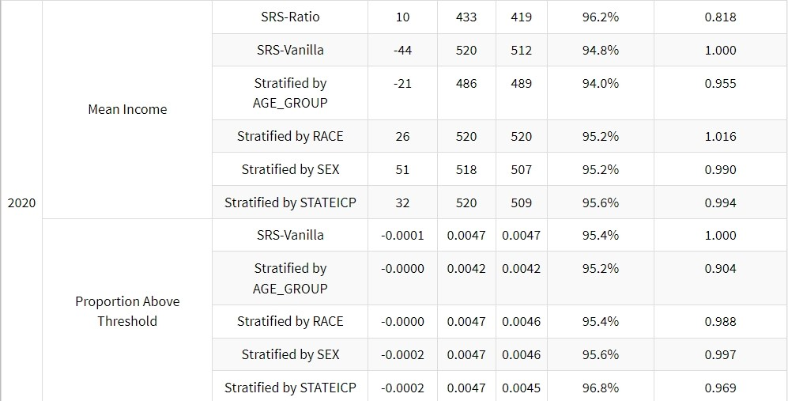
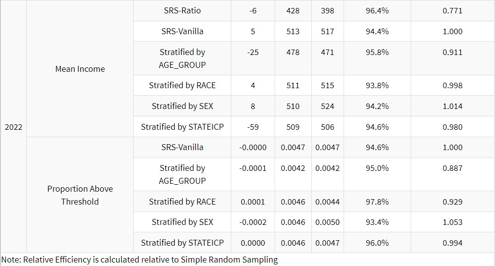
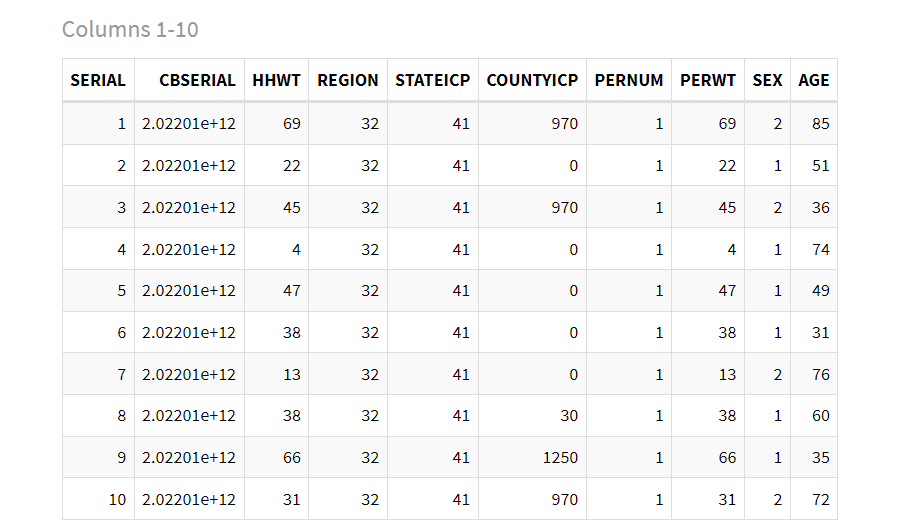
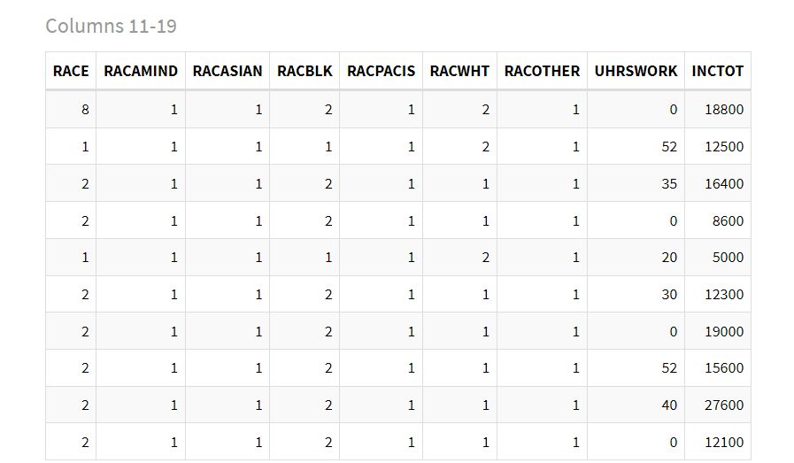
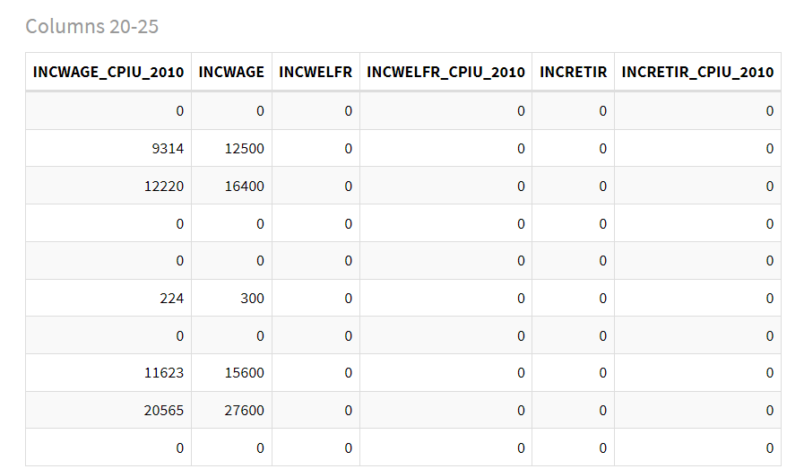
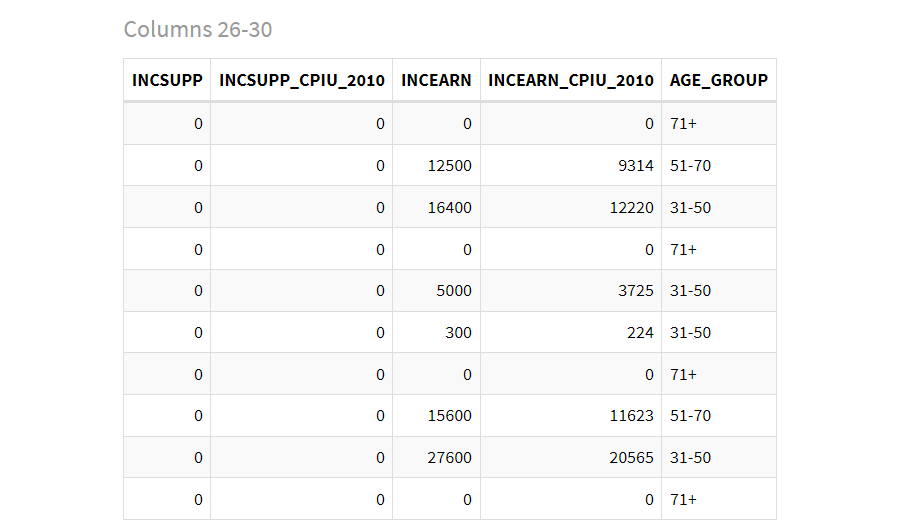

  
  
  
  

**Team Members & Contributions**:  

  - **Jiangzhe Liu** (*Group Leader*) - ***33914714***: 
    - **Project Design**
    - **Data Fetching**
    - **Exploratory Data Analysis**
    - **Sampling Code**
    - **Report Modification**
  - **Siyi Man** - ***67937664***:
    - **Target Parameter Determination**
    - **Report Introduction Part**
  - **Yucheng Gong** - ***96710447***:
    - **Data Cleaning & Preprocessing**
    - **Report Main Analysis Part**
  - **Jinyuan Zhou** - ***41159278***:
    - **Sampling Simulation Code**
    - **Report Discussion Part**


\pagebreak

# Project Overview
This study aims to conduct an objective analysis of economic well-being among **US citizens** by comparing personal income levels across different presidential administrations, specifically focusing on the **Trump** (2016-2020) and **Biden** (2021-2022) presidencies. 
Through systematic sampling and statistical analysis of IPUMS USA microdata, our **primary objective** is: to *evaluate whether there are significant differences in citizen economic outcomes(i.e. change in **personal yearly total income** & change in **proportion of people whose income is above a certain threshold**) between these administrative periods.*

## Data Source 
The sampling population is derived from The Integrated Public Use Microdata Series (**IPUMS USA**), focusing on US citizens' income, gender, age as well as other 21 demographic variables(excluding sampling ID & sampling weights & dummy variables) in **3 pivotal years**:  

  - **2016**: Pre-Trump presidency baseline
  - **2020**: End of Trump's term
  - **2022**: Mid-term of Biden's presidency

## Target Parameters 
In our dataset, there're 6 personal income types:  

1. **INCTOT**: total personal income  


  - It reports each respondent's total pre-tax personal income or losses from all sources for the previous year  

2. **INCWAGE**: wage and salary income  


  - It reports each respondent's total pre-tax wage and salary income, that is, money received as an employee for work or services performed  


3. **INCWELFR**: welfare(public assistance) income  


  - It reports how much pre-tax income (if any) the respondent received during the previous year from various public assistance programs  


4. **INCRETIR**: retirement income  


  - It reports how much pre-tax retirement, survivor, and disability pension income, other than Social Security, the respondent received during the previous year  


5. **INCSUPP**: supplementary security income  

  - It reports how much pre-tax income (if any) the respondent received from Supplemental Security Income (SSI) during the previous year  


6. **INCEARN**: total personal earned income  


  - It reports income earned from wages or a person's own business or farm for the previous year  


However, we wish to only focus on 1 specific type of income that is **most relevant to people's well-being**, which we here define as ***how fair the income is compatible to the efforts taken***.

So we conducted a correlation analysis, the results are shown in **Figure 1, 2 & 3**. And we noticed that ***INCEARN*** has the highest correlation with ***UHRSWORK***[^1] in all 3 years. Thus it is safe to assume that it is a good indicator of the effort taken. 

Moreover, in *economic research*, ***INCEARN*** is also a critical metric for assessing the economic well-being of citizens. Thus, using this metric as the research subject will allow us to **better analyze the income distribution* of U.S. residents during the terms of two different presidents *with higher credibility*.

Thus, our research will mainly focus on this type of income.

```{r Figure 1.1, echo=FALSE, out.width="70%", fig.align="center", fig.cap="Correlation between consecutive variables in 2016"}

```


[^1]: Usual number of hours a person worked per week

```{r Figure 1.2, echo=FALSE, out.width="70%", fig.align="center", fig.cap="Correlation between consecutive variables in 2020"}

```

```{r Figure 1.3, echo=FALSE, out.width="70%", fig.align="center", fig.cap="Correlation between consecutive variables in 2022"}

```

### Determining Income Threshold

After determining the *1st target parameter* —— ***average yearly earned income of all US citizens***, we are also interested in a *2nd target parameter* —— ***the proportion of people who can earn higher than a certain amount in a single year*** 

The **reason** we are interested in this parameter is that:  

  - Through analyzing the above-medium income earners, this study can capture *a critical segment of the population* whose financial performance is often **indicative of larger macroeconomic trends**.
  - So by adding a comparison between the proportion of people with high INCEARN levels across president administrations, we can make a **more objective evaluation** of the economic trajectories shaped by the two presidents and their different policy priorities.


Moreover, according to *Economic Policy Institute's research*, the top 5% in the United States has an income of **$308,487**, **$322,349**, and **$335,891** in **2019**, **2020**, and **2021** respectively. 

Since our report mainly focused on the Trump (2016-2020) and Biden (2021-2022) presidencies, here we will adopt ***$30,000*** as the threshold for indicating **"above medium income individuals"**.


### Other considerations
And finally, to eliminate the impact of **inflation** on our analysis, all the income data we use in this project are U.S. CPI-adjusted dollar volumes (adjusted to *2010*).

# Main Analysis

## Sampling Methodology
We will mainly use 2 sampling methods in this project: ***SRS*** & ***Stratified Sampling***. And we will use **proportional allocation** to determine the sample size of each stratum in **Stratified Sampling**.

  - For the **1st** target parameter: *mean income*,   
  
    we will use **both vanilla & ratio estimation** under **SRS**; and **only vanilla estimation** under **Stratified Sampling**.
    (in **ratio estimation**, we will use ***UHRSWORK*** as the auxiliary variable.)  

  - For the **2nd** target parameter: *proportion of people whose income is above a certain threshold*,  
  
    we will **drop the ratio estimation** under **SRS**, with other methods **remaining the same**.  

And we will also conduct multiple simulation samplings to compare the performance of these methods.
  
The reason we choose these 2 sampling methods are:  

  - both *SRS* & *Stratified Sampling* are **simple & easy to implement**, therefore **cost-effective** in real-world applications
  - *Stratified Sampling* ensures **representation of all important subpopulations** in the final sample & **reduces sampling error** by creating homogeneous groups

### Choosing Stratification Variables
Based on our dataset, we selected **4 key demographic variables** for stratification:

1. **Geographic Location (STATEICP)**

2. **Gender (SEX)**
   - Binary classification (Male/Female)

3. **Age Groups (AGE_GROUP)**
   - Custom categorization:
     * 0-18: Youth/Dependents
     * 19-30: Early Career
     * 31-50: Mid Career
     * 51-70: Late Career
     * 71+: Retirement Age

4. **Race (RACE)**
   - Nine categories:
     * White
     * Black/African American
     * American Indian or Alaska Native
     * Chinese
     * Japanese
     * Other Asian or Pacific Islander
     * Other race
     * Two major races
     * Three or more major races

These stratification variables were chosen because they:  

  - Represent key demographic factors affecting income distribution  
  
  - Have clear, well-defined categories  
  
  - Provide sufficient sample sizes within each stratum  
  
  - Allow for meaningful further socioeconomic analysis (e.g. income inequality, poverty rate, etc.)

### Determining Sample Size

To determine an appropriate sample size for our study, we considered several factors:

1. **Precision Requirements**:
   - We only aim for a **m.o.e. of less than ±1%** for our proportion estimates
   - (the value of income is consecutive, hence we cannot give a safe guess of the variance of income)
   - Desired confidence level: 95%

2. **Resource Constraints**:
   - Computing limitations for personal computer
   - Cost of sampling a single person in real world can be high

3. **Population Characteristics**:
   - High variability in income data & data across years  
   - Large population size (N > 2,500,000 for all 3 years)

Based on these considerations, we calculated the required sample size using:

$$n = \frac{z_{0.975}^2 \cdot \hat{p} (1 - \hat{p})}{\delta^2}$$

**where:**  

  - $\hat{p}$ is our guessed ratio of the true proportion of people whose income is above the given threshold, and we believe this ratio is **less than 0.35**.  
  - $\delta$ is the maximum margin of error we can accept, which we set to **0.01**.
  - $z_{0.975}$ is the z-score corresponding to the 95% confidence level, which is **1.96**.


Finally, we chose a sample size of **n = 8740** for all our sampling schemes later used, which:  

  - ***Provides sufficient precision for our estimates***  
  
  - ***Minimizes potential real-world sampling costs***  
  
  - Allows for efficient & swift computation in our simulation studies  
  
  - Large enough to support stratified sampling with multiple strata


### Formulas


For ***SRS-Vanilla estimation*** on each year's data, we use the following formula to calculate the estimate & its SE:  

$$
\hat{\bar{y}}_{vanilla} = \frac{1}{n} \sum_{i \in S} y_i
$$

$$
SE(\hat{\bar{y}}_{vanilla}) = \sqrt{(1-\frac{n}{N})\frac{s^2}{n}}, \text{ where } s^2 = \frac{1}{n-1}\sum_{i \in S}(y_i - \hat{\bar{y}}_{vanilla})^2
$$


For ***SRS-Ratio estimation*** on each year's data, we use the following formula to calculate the estimate & its SE:  

$$
\hat{\bar{y}}_{ratio} = \hat{R}\bar{x}_P, \text{ where } \hat{R} = \frac{\sum_{i \in S} y_i}{\sum_{i \in S} x_i}
$$

$$
SE(\hat{\bar{y}}_{ratio}) = \sqrt{(1-\frac{n}{N})\frac{s_e^2}{n}}, \text{ where } s_e^2 = \frac{1}{n-1}\sum_{i \in S}(y_i - \hat{R}x_i)^2
$$

**where:**  

  - $y_i$ is the income for person $i$
  - $x_i$ is the usual number of hours worked per week for person $i$ 
  - $\bar{x}_P$ is the known population mean of the usual number of hours worked per week
  - $n$ is the sample size
  - $N$ is the population size

For ***Stratified Sampling-Vanilla estimation*** on each year's data, we use the following formula to calculate the estimate & its SE:  

$$
\bar{y}_{str} = \hat{\bar{y}}_p = \sum_{h=1}^{H} \frac{n_h}{n} \cdot \bar{y}_{S_{h}}
$$

$$
SE(\bar{y}_{str}) = \sqrt{\sum_{h=1}^{H} \left( \frac{n_h}{n} \right)^2 \cdot (1 - \frac{n_h}{n}) \cdot \frac{s_{s_{h}}^2}{n_h}}, \text{ where } s_{s_{h}}^2 = \frac{1}{n_h-1}\sum_{i \in S_h}(y_i - \bar{y}_{S_{h}})^2
$$

**where:**  

  - $n_h$ is the sample size of stratum $h$
  - $n$ is the total sample size
  - $\bar{y}_{S_{h}}$ is the sample mean of stratum $h$

And by the simulation of conducting all sampling schemes on 3 years' data for **500** times, we have the following average estimates & CIs for mean estimate & proportion estimate (***Figure 4***)[^2]:

[^2]: Red dashed lines in ***Figure 4*** indicate true population values

## Results & Conclusion

```{r Figure 2.1, echo=FALSE, out.width="75%", fig.align="center", fig.cap="Avg. Estimates and CIs Using Various Sampling and Estimation Methods Across 2016, 2020, 2022"}

```

Looking at the above figure, we can easily see that:  

  - Mean income showed an *increasing trend* **from 2016** (~22,800) **to 2020** (~24,000), followed by a *slight decline* from **2020** (~24,000) to **2022** (~23,500)
  - Proportion of people whose income is above $30000 also showed an *increasing trend* **from 2016** (~0.25) **to 2020** (~0.28), followed by a *slight decline* from **2020** (~0.28) to **2022** (~0.27)

This suggests U.S. had witnessed a **better growth in people's well-being in terms of income** during *Trump's presidency (2016-2020)* but then a **slight drop** during *Biden's early term (2020-2022)*.

Which then leads to the ***conclusion*** that:  

  1. There is a significant difference in citizen economic outcomes between these 2 administrative periods:  
    1. $\Delta_{2016-2020}(\text{mean income}) \approx \$1200 > 0$  
    2. $\Delta_{2020-2022}(\text{mean income}) \approx -\$500 < 0$  
    3. $\Delta_{2016-2020}(\text{proportion of people whose income is above \$30000}) \approx 3\% > 0$  
    4. $\Delta_{2020-2022}(\text{proportion of people whose income is above \$30000}) \approx -1\% < 0$  
  2. *Trump* had done a **better job** than *Biden* in boosting the income levels of the **general population** during his presidency


## Comparison of Sampling Methods

Beyond our *conclusion*, we want to take a further look at the ***performance metrics of different estimation methods*** throughout the whole simulation process in all 3 years.  

**These metrics include:**  

   1. **Average Bias**  
      - Avg. difference between the estimate and the true population parameter
   2. **Average SE**
      - Avg. standard errors of the estimates
   3. **RMSE**
      - Rooted Mean Squared Error of estimate compared to the true population parameter
   4. **Coverage Rate**
      - Proportion of CIs that contain the true population parameter
   5. ***Relative Efficiency***
      - Ratio of the variance of the RMSE to the RMSE of the SRS estimator

And the results are shown in ***Figure 5***:

```{r Figure 2.2, echo=FALSE, out.width="75%", fig.align="center"}

```

```{r Figure 2.3, echo=FALSE, out.width="75%", fig.align="center"}

```

```{r Figure 2.4, echo=FALSE, out.width="75%", fig.align="center", fig.cap="Sampling Methods Performance Comparison"}

```

From ***Figure 4 & 5*** combined, we can make the following comparisons:  

  - All 3 estimation methods (SRS-Ratio, SRS-Vanilla, and Stratified) **successfully captured the true population parameters** (as shown by the red dashed lines falling within the confidence intervals)
    - All methods produced **consistent** estimates with overlapping confidence intervals (coverage rate $\approx$ 95%)
    - All methods yield **unbiased** estimates as they cluster around the true population values 
  - ***SRS*** generally performs better than ***Stratified Sampling*** in terms of all metrics, which is expected as stratified sampling *requires more information about the population* & is *more complex to implement*.
  - ***SRS-Ratio*** outperforms ***SRS-Vanilla*** in terms of RMSE **in all 3 years**, which indicates that the ***ratio estimation*** is more precise than ***vanilla estimation*** when the ***auxiliary variable*** is **strongly correlated** with the **income**.
  - In ***Stratified Sampling***, different stratification variables (AGE_GROUP, RACE, SEX, STATEICP) produced very similar results, and the **strata variable that has the highest relative efficiency differs** across these 3 years. Specifically:
    - For **2016**, taking ***RACE*** as strata variable can yield a **higher relative efficiency** than *all other methods used* in both mean($\approx$ 1.036) & proportion($\approx$ 1.007) estimation
    - For **2020**, taking ***RACE*** as strata variable can only yield a **higher relative efficiency** than all other methods in both mean($\approx$ 1.016) estimation, while in proportion estimation, taking ***SEX*** as strata variable can yield the highest efficiency than other strata variables used, but still lower than ***SRS***($\approx$ 0.997)
    - For **2022**, taking ***SEX*** as strata variable can yield a **higher relative efficiency** than *all other methods used* in both mean($\approx$ 1.014) & proportion($\approx$ 1.053) estimation


# Discussion
## Limitations & Considerations

Limitations for our project mainly comes from the following aspects:  
  
  - **Sampling methods:**
    - ***SRS***
      - Higher chance of missing rare but important instances (considering weights)
      - Can be logistically challenging to implement in real world in large geographical areas
      - Can be inefficient for highly variated data
      - Can be more expensive and time-consuming when population is widely dispersed
    - ***Stratified Sampling***
      - Requires prior knowledge of key population strata characteristics & sizes
      - More complex & costly to implement than SRS
      - *With proportional allocation specifically*:
        - May **not provide enough samples from smaller strata** for meaningful analysis
        - Not optimal when **costs of sampling vary** between strata
        - **Less efficient when variability of interest is similar** across strata
  - **Data:**
    - **Data Timeliness**
      - Our newest data during the Biden administration is only available until 2022, which may not be ***sufficiently long*** to capture the long-term trends in income distribution. 
      - Though it is already suffice to make the above conclusions.
    - **Population Data is actually a large sample**
      - (See ***Section 3.2***)
  - **Lack of real-world factors:**
    - There're many other factors in real world that may affect people's income & well-being that were *not included* in our dataset & analysis, such as:

      - **Economic lag effects from policy implementation**
      - **Impact of COVID-19 pandemic on 2020-2022 data**
      - **External global economic factors**
      - **Structural changes in the economy**


## Data Justification


Another thing to note is that our *population* data from IPUMS USA already represents ***a sample of*** the total US population, we consider using it as our sampling population methodologically sound for several reasons:  

  - IPUMS USA employs scientifically rigorous sampling methods that **ensure representativeness of the US population**
  - The large sample size and sophisticated sampling design of IPUMS data provides **sufficient statistical power**
  - The data undergoes thorough **quality control** & **harmonization** processes
  - The sampling weights (*though not used in this project*) provided by IPUMS allow for appropriate **population-level inference**
  - This approach is **consistent with common practice** in social science research using complex survey data

## Generalizability

As for the **generalizability** of our conclusions, we have the following considerations:  

  - First, while our conclusions can be reasonably generalized to the larger US citizen population due to IPUMS USA's rigorous sampling methodology and our comprehensive stratification approach, caution should be exercised when extending these findings to **non-citizen populations** or **those operating in informal economies**.  
  
  - Second, generalizing these conclusions to other presidential terms **requires careful consideration**, as our analysis period (2016-2022) encompassed unique circumstances, particularly the **COVID-19 pandemic's unprecedented economic impact**. Additionally, different presidential terms may face **distinct economic challenges**, **policy environments**, and **global conditions** that could significantly influence income patterns, making **direct comparisons potentially problematic** without accounting for these contextual differences.


\pagebreak


# Appendix  


 
## Dataset Overview  
Here's a glimpse of the first 10 rows from our 2022 dataset:
```{r Figure 4.1, echo=FALSE, out.width="100%", fig.align="center"}

```

```{r Figure 4.2, echo=FALSE, out.width="100%", fig.align="center"}

```

```{r Figure 4.3, echo=FALSE, out.width="100%", fig.align="center"}

```

```{r Figure 4.4, echo=FALSE, out.width="100%", fig.align="center"}

```


  
## Code  


### Main Script (main.R)
Main analysis script containing data processing, simulation setup and result visualization.
```{r, eval=FALSE, code=readLines("main.R")}
```

### Utility Functions (utils.R)
Helper functions for sampling, estimation and visualization used in the main analysis.
```{r, eval=FALSE, code=readLines("utils.R")}
```